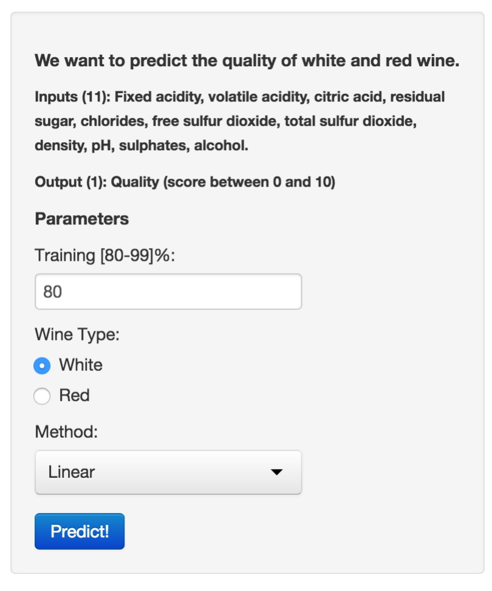
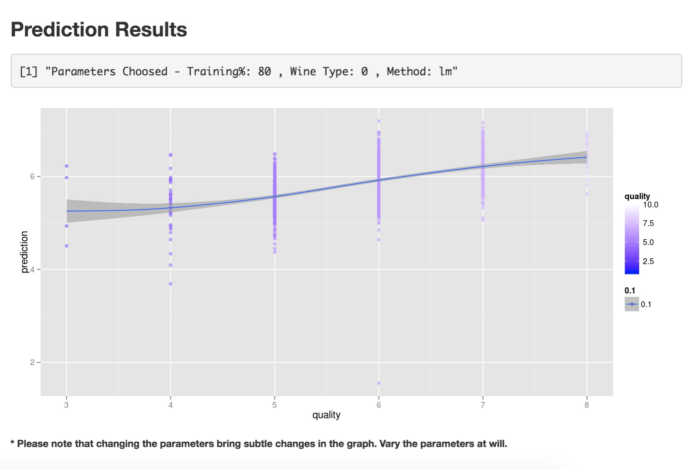

---
title       : Wine Quality Predictor App
subtitle    : Presentation
author      : Diego Marinho de Oliveira
job         : Data Scientist
framework   : io2012        # {io2012, html5slides, shower, dzslides, ...}
logo        : logo.jpg
highlighter : highlight.js  # {highlight.js, prettify, highlight}
hitheme     : tomorrow      # 
widgets     : [bootsrap, quiz, mathjax]            # {mathjax, quiz, bootstrap}
mode        : selfcontained # {standalone, draft}
knit        : slidify::knit2slides
--- 

## Problem

* **Description:** A company hired me to do the analysis of the quality of White and Red wines of a particular crop in Portugual. However, I am no expert wine. Thus a way that I got to solve the problem was to collect real data of characteristics related to quality of wines. From these data I was able to create an online application that can extrapolate and predict the quality of Portuguese wine.

* **Data:**
    * Input consists of 11 variables. fixed acidity, volatile acidity, citric acid, residual sugar, chlorides, free sulfur dioxide, total sulfur dioxide, density, pH, sulphates and alcohol. 
    * Output consists of qualify of Wine with score between 0 to 10. 

--- .class #id

## Wine Quality Predictor App  

 

* The **Wine Quality Predictor App** is composed of two parts, the first is the interactive panel and the second is the result panel.

* At the interactive panel we can adjust some parameters to better tunning our prediction model. The parameters are the training percentage size, wine type and the method to fit the data.

* To generate and evaluate the predictor with the new parameters, please click in '*Predict!*'.

--- .class #id

## Understand Results

* The results are shown in the graph panel two. As can be seen there is a line with the description of the parameters entered and then one graph. The graph shows the result of quality wine predicted vs. observed. The ideal is $x_{i} = y_{i}$ for all $x_{i} \in X$ and $y_{i} \in Y$.
<center>
 
</center>

--- &radio

## Did you see the R expression be evaluated?


```r
   a <- 0.5; b <- 5; x <- 1:10; 
   y <- a * x + b
   print (y)
```

```
##  [1]  5.5  6.0  6.5  7.0  7.5  8.0  8.5  9.0  9.5 10.0
```

1. _Yes_
2. I don't know
3. No

*** .hint
You need only to answer it.

*** .explanation
This only a iterative test.
